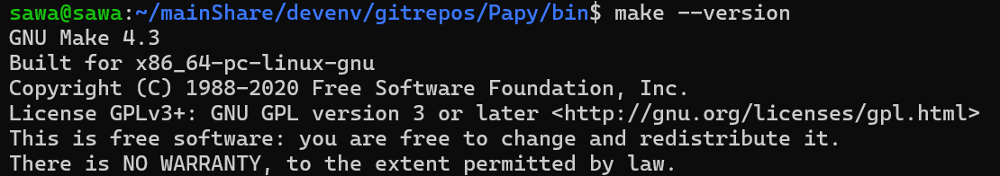
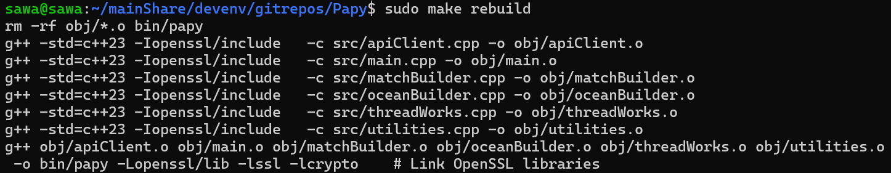
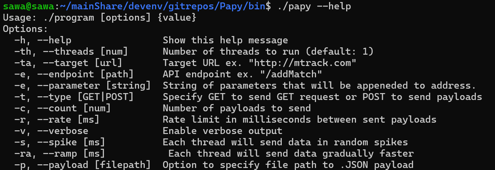
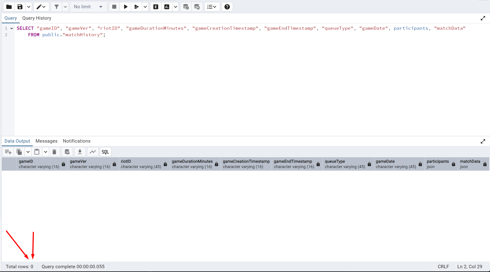
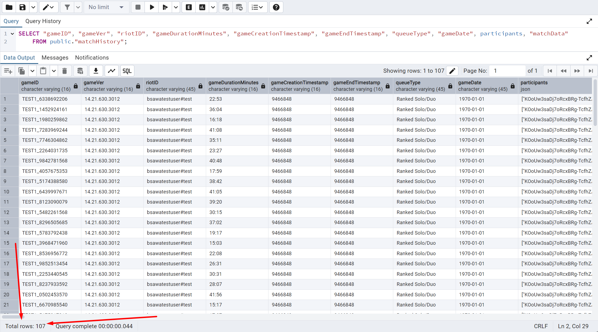
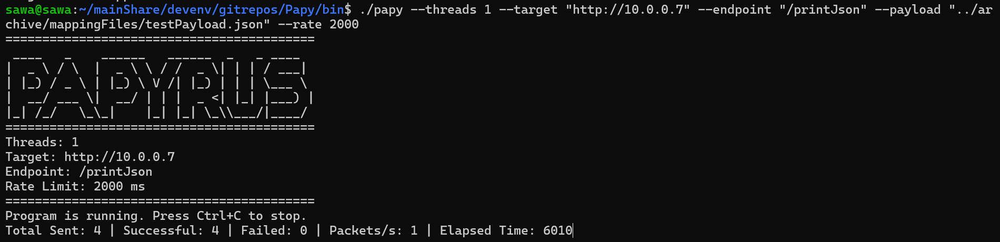

<div align="center">

# Papy (Papyrus)

</div>

Papy is an open-source framework that lets us rapidly generate a large quantity of semi-random and static JSON data that will be used to test API endpoints that consume those JSON bodies and process the data in their backend. 


Why is it that other projects:
- Don't have a simple build process
- Don't have a light weight footprint
- Don't have an easily portable and self contained codebase
- Cant send HTTPS AND HTTP traffic
- Cant send GET AND POST requests
- Can not simply perform all of the following tasks in one application:
	- Health check services
	- Bulk create and send data to network connected services
	- Load test back-end business logic and attached databases

Well with Papy we can do ALL OF THAT!!!

Lets get into how we do this...


## Table of Contents
1. [Introduction](#introduction)
2. [Getting Started](#getting-started)
3. [User Interface](#user-interface)
4. [Notable Command Line Arguments](#notable-command-line-arguments)
6. [Ask The Dev](#ask-the-dev)
7. [Disclaimer](#disclaimer)
8. [Contributing](#contributing)

---

## Introduction

Papy is an open-source command line tool API load testing tool that is meant to be light weight, fast, and flexible.

### Key Features
Some of the key features include:
- Customized targetting (server address and endpoint)
- Customizable payloads
- Pseudo randomized payloads
- Verbose or compact response reporting
- HTTP and HTTPS traffic capabilities
- Traffic controls
  - Spike traffic
  - Ramp traffic
  - Rate limited traffic


### Target Audience
If you are a user familiar with a CLI then you can use this tool! It was intentionally developed to be: 
- Simple to use
- Easy to integrate with other tooling
- Light weight

### Dependencies
The project has 3 main dependencies that were vendored into the project. As of the current implementation they are: 
- nlohmann/json version 3.11.3
- httplib.h version 0.18.1
- OpenSSL version 3.4.0 

---

## Getting Started

### Installation
The following is a step-by-step set of instructions for installing or accessing Papy.

First things first is to clone the repo:
```bash
git clone https://github.com/noahpop77/Papy.git
```

Then you need to navigate to the cloned Papy directory:
```bash
cd Papy
```

You will need functional build system. In the case of Papy I used makefile to build the project. You can determine if you have make installed by using:
```bash
make --version
```


The command to build Papy is the following once you are in the project root directory. 
```bash
make build
```


### Initial Setup
Now we got Papy up built and ready for you! Lets get our hands on it now. After the build the Papy Binary/executable will be in the `bin` directory.

Navigate to the `Papy/bin` directory:
```bash
cd bin
```

Papy will be in the `bin` directory. Run the Papy help command to get a sense of what flags you can make use of and to verify that papy was built successfully.
```bash
./papy --help
```


### First Steps
Lets launch some requests! The following are examples of possible use cases and the commands that would go along with them. Papy is highly configurable though so there are many more possible configurations depending on what you are trying to achieve.

If you want to launch a bunch of GET requests to a specific site:
```bash
./papy --threads 4 --target "https://www.{YOUR_TARGET_IP_ADDR}.com"
```

> WARNING: This is to demonstrate you can query public websites but use this responsibly. Overuse or non-permitted usage could cause legal problems for you. Best to use the tool on resources you own.

If you want to send a static payload from a JSON file then simply specify the file path to your JSON file. The following command looks to the directory structure `../archive/mappingFiles/testPayload.json` for example to send `testPayload.json` as the body of the POST requests. This command also displays the functionality of the `--rate` flag which rate limits the requests by adding a delay of X milliseconds between each request.
```bash
./papy --threads 1 --target "http://10.0.0.7" --endpoint "/printJson" --payload "../archive/mappingFiles/testPayload.json" --rate 2000
```
The contents of `testPayload.json` are as follows:
```json
{
    "overrides": {
        "business_unit" : {
            "name" : "BOB"
        },
        "application" : {
            "name" : "BOB"
        },
        "project" : {
            "name" : "BOB"
        }
    }
}

```

> **Note:** The bottom terminal is a locally deployed web application that prints the body of its received POST requests for demonstration purposes. As you can see the payload that is being sent is the same payload that is being received by the Python web server.

The following is an example of me testing the database of a locally deployed web application I created called [M-Track](https://github.com/noahpop77/M-Track). This execution run will use the randomized payload generation for League of Legends. The lol payload will trigger a class in the tool to generate a randomized League of Legends match file and send that to the API endpoint of [M-Track](https://github.com/noahpop77/M-Track).
```bash
./papy --threads 4 --target "http://10.0.0.7" --endpoint "/addMatch" --payload lol
```


#### M-Track PostgreSQL Databse Before Papy


#### M-Track PostgreSQL Databse After Papy



---

## User Interface 
Since this was designed to be simple as well as a Command Line Interface tool the UI follows this paradigm. You can see the UI information of Papy with any exeuction of the Papy command like:
```bash
./papy [Flag] {Value} [Flag] {Value} [Flag] {Value} ...
```


---

## Command Line Arguments

### -h, --help
This argument has no parameter, it is not meant to be used with running the actual application, and will override any other arguments given alongside it. It displays all possible command line arguments (see below), how the command should be formated, and an example command to run the application. 

### -th, --threads [num]
This parameter lets you specify the amount of CPU threads you want to use for the programs execution. The more you add the more concurrent requests will be sent. If you try to assign more threads that you have physically then the speed will not necessarily increase due to the CPU having to switch between the active tasks anyways so there is no real point to assigning more threads that you physically have on your CPU. Faster threads however do assist in the speed of requests per thread.

### -ta, --target [url]
Assigns the url of the target. Should be in the format `http://www.mtrack.com`. Specifically the `http://` or `https://` portion of the address must be included. This is because this is how Papy determines which protocols to use to send the requests. 

### -e, --endpoint [path]
Specifies the endpoint of the specific server. This endpoint string gets appended to the target address. So if you want to query the target `https://www.mtrack.com` and the endpoint `/addMatch` you can use the command:
```bash
./papy --threads 1 --target "https://www.mtrack.com" --endpoint "/addMatch"
```

### -pa, --parameter [string]
The `--parameter` flag lets you specify end of URL paramaters. For example, the following Papy command will yield the final url of `https://www.mtrack.com/addMatch?variable=BOB`.
```bash
./papy --threads 1 --target "https://www.mtrack.com" --endpoint "/addMatch" --parameter "?variable=BOB"
```

### -c, --count [num]
This parameter will let you specify the amount of payloads that each thread will launch. If you have a single thread and specify `--count` to be 10 then Papy will launch 10 requests. If you however have `--threads` set to 4 and you have `--count` set to 10 it will launch 40 requests. The count number is FOR EACH THREAD.  

### -r, --rate [ms]
`--rate` specifies the delay in milliseconds between payloads being sent out. If you specify `--rate 2000` then there will be a 2 secon delay between each set of packets being sent out. Once again if you have the threadcount set to 4 and a delay of 2000 then 4 packets will be sent out every 2 seconds. The delay is also per thread.


### -v, --verbose
This flag has no parameter. If it is present in the command line arguments it will enable verbose output. It will show you the response of each request being sent out. Without this flag all you will see in terms of the responses of the requests is the main statistics line for Papy.
```
Total Sent: 36 | Successful: 36 | Failed: 0 | Packets/s: 1 | Elapsed Time: 70099
```

### -s, --spike [ms]
This flag lets you specify a "spike" time. What happens is that whatever delay in ms you set for this flag will be used to calculate when the payloads will be sent out. Each request will be sent out at a random delay between zero and the number that you set. This makes the traffic much more chaotic and similar to real world situations.

### -ra, --ramp [ms]
This flag lets you specify test a ramping simulation. The traffic will have a delay of the one you set for the `--ramp` flag and then get halved each time a payload is sent. It will ramp faster and faster until it runs at the max speed capable of your hardware.

### -p, --payload [null] || [string] || [filepath]
This is where a good amount of the meat of the functionality is. Depending on the payload that you set you will have behavior vary drastically. At the moment there are 4 main operating modes:
- No payload
- `lol`
- `ocean`
- `{filepath}`
  - ex. `./home/jsonFiles/bob.json`

If no payload is set then Papy will send GET requests to the specified address and endpoint.

If `lol` is set then it will generate a custom pseudo-random payload based off the specifications in a custom class. 

If `ocean` is set then it will generate a custom pseudo-random payload based off the specifications in a custom class.

If a file path is specified then Papy will look for a JSON file and parse it. That parsed JSON will then be used as a body for the payload.

---

## Documentation
The [User Documentation](docs/userDocumentation.md) and [Developer Documentation](docs/developerDocumentation.md) can provide further information on different aspects of Papy.

---

## Ask The Dev
For questions you can contact me on LinkedIn or my email. If you have any recommendations maybe even make a PR. Im open to any feedback!

All contact information is listed on my profile.

---

### Name Meaning

This section is completely for fun. I named the project based off the latin word papyrus for paper. I figured that paper is what contains much of humanities knowledge and it is also where people go to obtain new knowledge from others. So the link between that and a project that generates a ton of information was not a far leap for me in my mind.

---

## Disclaimer
- PLEASE DO NOT USE THIS FOR MALICIOUS PURPOSES
- GET PERMISSION FROM THE OWNER OF RESOURCES YOU WILL USE THIS TOOL AGAINST
- I TAKE NO RESPONSIBILITY FOR THE ACTIONS OF USERS OF THIS APPLICATION

---

## Contributing

If you would like to contribute to this project it is quite easy (I may be biased since it is my project). Follow the [Getting Started](#getting-started) section and that will get you up and running. 

Regarding actually contributing code, please fork the repository and open a pull request to the `main` branch. I will review it as soon as I can.

My Practices:
- Naming Variables:
	- I use camel case for all variable and class names. 
- Structure:
	- Each logical fucntion is seperated into its own `.cpp` file with an accompanying `.hpp`.
	- All sub `.hpp` files are connected to `common.hpp` and that is `#included` into the `main.cpp` file.

---

### Personal Notes

The directory structure that will be used as a reference will be:
```
project_name/
|-- src/
|   |-- main.cpp
|   |-- module1/
|   |   |-- module1.cpp
|   |   |-- module1.h
|   |-- module2/
|   |   |-- module2.cpp
|   |   |-- module2.h
|-- include/
|   |-- project_name/
|   |   |-- module1.h
|   |   |-- module2.h
|-- lib/
|-- tests/
|   |-- unit_tests.cpp
|-- build/
|-- doc/
|-- CMakeLists.txt
|-- README.md
```

The following is a set of helper functions or terminal settings I use for my personal setup and are by no means required for Papy. They are just useful.
```bash
# This will export the following zshrc PS1 terminal settings and get my
#   terminal looking like how I preffer
# Looks like:
#
# bsawa@Z-Drive src
# ->  
export PS1="%{$(tput setaf 36)%}%n%{$(tput setaf 36)%}@%{$(tput setaf 36)%}%m %{$(tput setaf 36)%}%1~
%{$(tput sgr0)%}-> "

# This function is meant to be added to the end of your ~/.bashrc file
# so that you can more easily compile your project
function comp {
    local filename="${1%.*}.out"
    sudo g++ -w "$1" -o "$filename" && "./$filename" "${@:2}"
}
```

Command to run build and execution with a test
```bash
sudo g++ main.cpp apiClient.cpp clock.cpp commandLine.cpp match.cpp matchBuilder.cpp myRandom.cpp payloadBuilder.cpp threadWorks.cpp -std=c++23 && ./a.out --threads 1 --target "http://10.0.0.7" --type GET
```

Alternatively the following now works as well

```bash
make rebuild
or
make build

cd bin
./papy --threads 4 --target "http://10.0.0.7" --type GET --verbose
```

> **Note:** Buiding with `make rebuild -j$(nproc)` works but is a little inconsistent and sometimes requires two attempts. Time savings of multi-threaded building of the binary is not really worth it and the usual `make rebuild` is fast enough build time wise and more consistent.

> **Note:** If you are building this on MacOS you will need to make a single change to the Makefile as it stands. The flag `-std=c++23` in the line `CXXFLAGS = -std=c++23 -I$(OPENSSL_DIR)  # Include local OpenSSL headers` will need to be changed to `-std=c++2b`.

#### Test User
Game Name + Tag: bsawatestuser#test

### Recent Changes:
- Rebuilt the header structure for the application
- Investigated Coroutines
- Implemented test makefile
	- Build works but only if you run the papy exe from within the bin directory right next to the mappign files.
- Payload can be run from anywhere, Mappings are embedded into the built executable

- I WANT TO EMBED THE JSON MAPPING FILES INTO THE EXECUTABLE SO THE THING IS ALMIGHTY PORTABLE

- Added a proper way of swapping between operating modes
	- Get requests primary
	- Flags for specific custom payload contexts
		- League
		- Ocean
	- `./papy --threads 4 --target "http://10.0.0.7" --endpoint "/addMatch"`
		- **Behavior:**  
			- GET Request
			- No payload
	- `./papy --threads 4 --target "http://10.0.0.7" --endpoint "/addMatch" --payload "{FilePath}"`
		- **Behavior:** 
			- POST Request
			- Specified filepath to JSON
				- Contents of file are streamed in, parsed, and used
	- `./papy --threads 4 --target "http://10.0.0.7" --endpoint "/addMatch" --payload lol`
		- **Behavior:** 
			- POST Request
			- Randomized Generated Match using `matchBuilder`
	- `./papy --threads 4 --target "http://10.0.0.7" --endpoint "/addMatch" --payload ocean`
		- **Behavior:** 
			- POST Request
			- Randomized Generated Match using `oceanBuilder`

- Is payloadBuilder doing anything? Remove it if not. Was just testing out stuff
	- Its been archived

- Work on enabling a simplified system of configuring payload
	- Create a sample payload for use to another API
	- Payload option is configured to:
		- Take in a filepath
		- Read in the file contents
		- Return the contents as JSON

- Wrote comprehensive documentation
	- User documentation
	- Developer documentation
	- Gathered gifs and pictures for documentation
	- Write documents in markdown in the docs directory

- Binary size was reduced from 3.6MB to 2.9MB. This was done by cleaning up includes(some more is still required), and trimming down mapping json objects.

- Simplify the JSON parsing for items to be a single parse pulling 6 random items rather than 6 different parses in getRandomFromJson()


### Performance Increases
- Went from 110 to 170 by adding GZIP encoding and running gzip_compress method on payload before running set-payload reducing size (18kb to 2.3kb packet sizes)   
```cpp
std::string threadWorks::gzip_compress(const std::string &data)

//Ex.
nlohmann::json lolPayload = matchBuilder::randomMatch();
std::string compressedLolPayload = gzip_compress(lolPayload.dump());
client.setPayload(compressedLolPayload);
response = client.sendPOSTRequest();
```
- Went from 170 to 360 with removing recreation of random device per call of generateRandomInt
```cpp
// Constructor to initialize the random number generator with a seed
std::random_device myRandom::rd;
std::mt19937 myRandom::gen(myRandom::rd());

int myRandom::generateRandomInt(int min, int max) {
    std::uniform_int_distribution<> distrib(min, max);
    return distrib(gen);
    
}
```

- Went from 360 to 400 with pulling 70 items per match in a single parse rather than parsing IEMS_JSON 70 times a match
```cpp
std::vector<std::string> participantItems = getRandomVectorFromJSON(mapping::ITEMS_JSON, 70);
```

- Went from 400 to 830 by batch parsing CHAMPIONS_JSON SUMMMONERS_JSON KEYSTONES_JSON SECONDARY_RUNES_JSON using:
```cpp
std::vector<std::string> participantChamp = getRandomVectorFromJSON(mapping::CHAMPIONS_JSON, 10);

std::vector<std::string> participantSummoners = getRandomVectorFromJSON(mapping::SUMMMONERS_JSON, 20);

std::vector<std::string> participantKeystone = getRandomVectorFromJSON(mapping::KEYSTONES_JSON, 10);

std::vector<std::string> participantSecondary = getRandomVectorFromJSON(mapping::SECONDARY_RUNES_JSON, 10);
```

- Went from 830 to 870 by making the mapping objects natively of type nlohman::json rather than strings that get parsed per program loop execution
```cpp
nlohmann::json KEYSTONES_JSON;
nlohmann::json SECONDARY_RUNES_JSON;
nlohmann::json SUMMMONERS_JSON;
nlohmann::json ITEMS_JSON;
nlohmann::json CHAMPIONS_JSON;
```

- Went from 870 to 905~ by doing the same for the MATCH_TEMPLATE_JSON that each game is built off of
```cpp
nlohmann::json MATCH_TEMPLATE_JSON;
```

- Went from 900 to 2400 by removing the random_devices from each call of generateRandomNumberString, generateRandomString, and getRandomBool.

```cpp
std::random_device myRandom::rd;
std::mt19937 myRandom::gen(myRandom::rd());
```

- Went from 2400 to 3000 by making the strings containing the set of characters the random device will pull from a char array and constant to the compiler (constexpr). Also made the size of the char array a constexpr so that we do not need to compute it repeatedly.

```cpp
constexpr char chars[] = "abcdefghijklmnopqrstuvwxyzABCDEFGHIJKLMNOPQRSTUVWXYZ0123456789";
constexpr size_t chars_len = sizeof(chars) - 1;

std::uniform_int_distribution<> distrib(0, chars_len - 1);
std::string randomStr;
for (size_t i = 0; i < length; ++i) {
	randomStr += chars[distrib(gen)];
}
return randomStr;
```

- Went from 3000 to 3300 by reserving the bits for the string that gets generated at the time the function is called so no resizing is required. Also made `std::uniform_int_distribution` static. It did not need to be remade every execution.
```cpp
constexpr char chars[] = "abcdefghijklmnopqrstuvwxyzABCDEFGHIJKLMNOPQRSTUVWXYZ0123456789";
constexpr size_t chars_len = sizeof(chars) - 1;

static std::uniform_int_distribution<> distrib(0, chars_len - 1);
std::string randomStr;
randomStr.reserve(length);
for (size_t i = 0; i < length; ++i) {
	randomStr += chars[distrib(gen)];
}
return randomStr;
```

- Went from 3.3k to 6k by removing the local random device in the matchBuilder::getRandomVectorFromJSON method and moved  getRandomVectorFromJSON to myRandom for stability and performance by using only a single random device.

- Went from 6k to 8k by removing declarations and copies of unnecessary vectors. Inside of the getRandomVectorFromJSON there was a vector that was used to append the requested random items from the JSON object and returned. This method resulted in an unnecessary declaration and copy. Passed original vector by reference and removed unnecessary copy and declaration of useless vector. Directly editing OG vector. 

```cpp
std::vector<std::string> participantItems;
participantItems = myRandom::getRandomVectorFromJSON(mapping::ITEMS_JSON, 70);

std::vector<std::string> participantItems;
myRandom::getRandomVectorFromJSON(participantItems, mapping::ITEMS_JSON, 70);
```

- WE ARE GETTING A LOT OF SEG FAULTS AT 8K
- Went from 8k to 7.6k The seg faults were caused by the global random device generator experiencing a race condition(The program was so slow up until now it didnt experience it, we hit real speeds and it experienced a race condition more often). Each thread was given its own local random device and generator. 

- SO CLOSEEEE

- It was at this point I took another look at `htop` while the program was running. CPU cores locked at 60% under full load, why? We were now getting limited by the TERMINAL. Since the terminal metrics line writes once per requests and we were now able to toss out 7.6k per second, we were actually experiencing more blocking operations while we waited to write to the screen and wasted time when we could be sending requests. That and with all of the efficiencies we added, turns out our limation was that we can send out requests so much faster and we were waiting for responses on my standard 16 threads testing command. So we could turn the core count up... by a lot...

```cpp
std::cout 	<< "\rTotal Sent: " << totalPayloadsSent
			<< " | Successful: " << totalPayloadsSuccessful
			<< " | Failed: " << (totalPayloadsSent - totalPayloadsSuccessful)
			<< " | Packets/s: " << packetsPerSecond
			<< " | Elapsed Time: " << clock.elapsedMilliseconds()
		  	<< "     "  // clear a few characters past the end
            << std::flush;
```

- Went from 7.6k 20k Up until now we were using blinders basically. This is also the part of the journey where we realise that running the Papy client, the GO endpoint and the PostgreSQL database on the same box is causing unintended performance issues for the non papy services LOL. HOWEVER even with this in mind. We can still reach 12k requests per second to the box. Even though all CPU cores are at 100% cause of the Papy client.

### Todo:

- Create make based github actions to auto compile per commit
- Investigate only having one participant in template and expanding the template with code at runtime

Tips from DemiTastes on theo disc
- README Examples of randomized data sent to mtrack

- Add AWS CloudWatch connection to ocean plugin for convenient metrics tracking
	- Configured in ocean plugin `.env` file


Next steps:

- Make the sending part of the net code better
- Read about core-mapping if you dig into the caches and from there you will understand why crossing what you have in your CPU called DIE does for net code
- Reading about core mapping to deal with inefficient cache use would be a good idea

- Some parallelization can be done
	- Batching area probably (depending on how much data you are working with)
	- Same with the generators

```
Useful GDB commands:

info threads
thread #
bt
```

Little present if you read all the way to the end:

<div align="center">
    
</div>