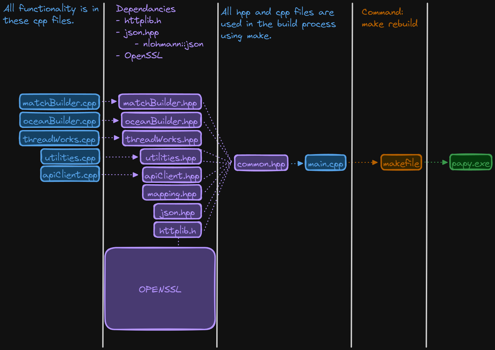
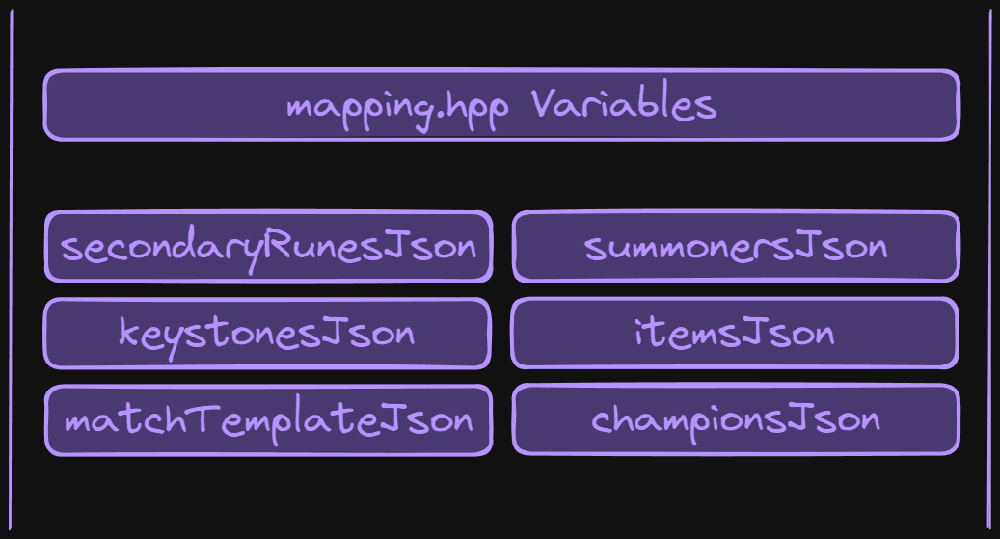

# Developer Documentation Template

## Table of Contents
1. [Introduction](#introduction)

---

## Title
Lorem Ipsum Lorem Ipsum Lorem Ipsum Lorem Ipsum Lorem Ipsum Lorem Ipsum Lorem Ipsum Lorem Ipsum Lorem Ipsum Lorem Ipsum Lorem Ipsum Lorem Ipsum 

### Sub-Title
Lorem Ipsum Lorem Ipsum Lorem Ipsum Lorem Ipsum Lorem Ipsum Lorem Ipsum Lorem Ipsum Lorem Ipsum Lorem Ipsum Lorem Ipsum Lorem Ipsum Lorem Ipsum 

---

# Developer Documentation

## Introduction

The purpsoe of the developer documentation primarily is to give the user insight into the mind of the developer (MEEEE) as to why I made the decisions I made while designing Papy. The developer documentation will not go over the content that was covered in the user documentation such as startup and usage instructions.

## High Level Architecture

The design of Papy is a simple one but not a one dimensional setup. Some of the design decisions may not be conventional but there is still a method to the madness. The breakdown is that the actual functionallity of Papy is written in `.cpp` files which are linked to their own respective header files along with the header files for any dependancies associated with the project. All of those header files are then linked to a single `common.hpp` file which is singly included into `main.cpp`. I did this primarily for clarity in my mind. Managing headerfiles can quickly get out of control and this is the most logical structure for my mind to follow.

Things of note in the header files are `httplib.h`, `json.hpp`, `openssl`, and the `mapping.hpp` file.

- `httplib.h` & `json.hpp`: These are two libraries that a being imported for use in the project and all of their functionality is within these header files themselves.
- `openssl`: Is another library that has a bunch of dependancy files associated with it. Its main use is for handling HTTPS connections so we can handle HTTPS as well as HTTP traffic. Its main connection is within the `apiClient.hpp` file.
- `mapping.hpp`: This is a very important file. This file contains all of the JSON objects that are used in mapping/creating random fields during payload generation. There are just a bunch of `const std::string` values in there that are later parsed as JSON and processed to produce a particular request.

Regarding the build process, since the project is relatively simple I did not need any complicated build systems so I used a makefile to make sure that the variables and environmental factors are consistent across builds. I will not bother putting the whole `makefile` here so I will just mention notable portions of it. 

- The project is currently being built with `-std=c++23`
- In the build flags we specify `-I$(OPENSSL_DIR)/include` which will include all of the openssl files in our `src/openssl/` directory which are necessary for HTTPS traffic and will be added to the build.  

## Project File Structure

### archive
The `archive` directory is basically a graveyard of files I might need to revive in the short term but at the moment are not in use.

### bin
Built executables and binaries will be put here

### obj
Build objects will be created here and used in the build process and subsequently cleaned up once they are of no use.

### docs 
Main pieces of documentation and the assets for it will be housed here. 
> Excalidraw drawings related to Papy will also he housed in a sub-directory of `docs`.

### src
Where the magic happens...
All of the Papy source files are housed here, both the header files and source C++ files. The only thing to note is this is where the `openssl` directory is also stored which is a rather large (file count wise) dependancy.
